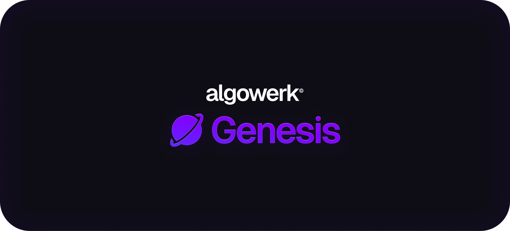

# Genesis Template

A robust full-stack template featuring a modern stack with Vite, React, and Express. This template is designed for rapid development with a focus on scalability, best practices, and a well-organized folder structure.

## 🚀 Install

Prerequisites: Node.js, NPM, degit (`npm install -g degit`)

Run this command in the folder you want to install template to
```bash
degit torstendngh/genesis .
```

> [!NOTE]  
> You may notice ".gitkeep" files in empty folders. They exist to force git from cloning the empty folders, to keep the folder structure intact. You can install this template withouth the ".gitkeep" files below

## 🚀 Install and remove .gitkeep files

The default install method (above) keeps the ".gitkeep" files so the folder structure stays in tact. If you want to remove these files on clone, run this command instead.

Prerequisites: Node.js, NPM, degit (`npm install -g degit`)

Run this command in the folder you want to install template to
```bash
degit torstendngh/genesis . && find . -name ".gitkeep" -delete
```

The command works as follows:

1. `degit torstendngh/genesis .`: Clones the genesis template repository from torstendngh into the current directory without including the .git folder.

2. `find . -name ".gitkeep" -delete`: Searches for all .gitkeep files within the current directory and deletes them.

This approach ensures that the necessary files and folders from the template are copied over, while cleaning up placeholder ".gitkeep" files used to track otherwise empty folders.

## 🔥 Features

- ✅ Front-End
- ✅ Back-End
- ✅ Mono-Repo
- ✅ Basic components
- ✅ Basic dependencies
- ✅ Basic folder structure

### Client-Side
- **Framework**: Vite + React
- **Routing**: React Router
- **Styling**: Inter Font, CSS Reset
- **Utilities**: Axios, Framer Motion, Motion
- **Authentication**: Clerk
- **Context**: Template Context for global state management
- **Folder Structure**: Organized and scalable
- **Configuration**: `jsconfig` for absolute imports
- **Client Components:**
    - **ProtectedRoute**: Secure routes for authenticated users
    - **Button**: Reusable button with variants
    - **Input**: Custom input fields
    - **Tabs**: Tabbed navigation
    - **Switch**: Toggle switch component
    - **Dropdown**: Interactive dropdown with search
    - **Tooltip**: Contextual tooltips
    - **Dialog**: Modal dialog boxes
    - **Link**: Styled navigation links
    - **LoadingIndicator**: Indicate loading states
    - **Toast**: Notification system
    - **NavbarTab**: Navigation bar tab template using NavLink

### Server-Side
- **Framework**: Express
- **Security**: Express Rate Limiter, CORS, Bcrypt
- **Utilities**: Dotenv for configuration, Body Parser for JSON handling
- **Authentication**: JWT-based authentication
- **Database**: SQLite3 for lightweight, file-based database
- **Unique IDs**: UUID for generating unique identifiers

## 📦 Dependencies

### Client
- [Vite](https://vitejs.dev/)
- [React](https://reactjs.org/)
- [React Router](https://reactrouter.com/)
- [Axios](https://axios-http.com/)
- [Framer Motion](https://www.framer.com/motion/)
- [Motion](https://motion.dev/)
- [Clerk](https://clerk.dev/)
- [UUID](https://github.com/uuidjs/uuid)
- [Dotenv](https://github.com/motdotla/dotenv)

### Server
- [Express](https://expressjs.com/)
- [Express Rate Limiter](https://www.npmjs.com/package/express-rate-limit)
- [Dotenv](https://github.com/motdotla/dotenv)
- [CORS](https://github.com/expressjs/cors)
- [Bcrypt](https://github.com/kelektiv/node.bcrypt.js)
- [Body Parser](https://www.npmjs.com/package/body-parser)
- [JWT](https://www.npmjs.com/package/jsonwebtoken)
- [SQLite3](https://github.com/mapbox/node-sqlite3)
- [UUID](https://github.com/uuidjs/uuid)

## Where should I start?

### Client Setup

1. Make sure you are in the client folder (`cd client`)
1. Install the dependancies `npm i`

### Start Client

1. Make sure you are in the client folder if not already (`cd client`)
1. Start the client with `npm run dev`

### Sample Screen

"src/screens/Dashboard/Dashboard.jsx" has a Sample component. this shows all components with sample data. you can delete the Sample component. Make sure to also delete the sample dialog options in "src/contexts/DialogContext.jsx".

### Dialogs (Modals)

Dialogs are controlled by "src/contexts/DialogContext.jsx". This makes a unified file for controlling all dialogs. When making a dialog use the component "src/components/Dialog/Dialog.jsx" as a base and add a state to the DialogContext.

### Pages & Routes

- All pages are in "src/screens"
- The dashboard screen is a starting point
- Editing routes can be done in "src/App.jsx".
- [This](https://blog.webdevsimplified.com/2022-07/react-router/) is a good learning resource for React Router

### Components

- Basic components are in "src/components"
- You can use them anywhere and easily edit their style.

### Style

- This template uses modules CSS
- The CSS reset is in "src/index.css"
- The default scrollbar style is in "src/index.css"
- Write CSS classes like this
    ```js
    className={styles.myClass}
    ```
- Multiple classes look like this
    ```js
    className={`${styles.myClass1} ${styles.myClass2}`}
    ```
- Conditional CSS classes
    ```js
    className={`${isVisible ? styles.isVisible : ""}`}
    ```
- the CSS looks like this, unchanged from normal CSS
    ```css
    .myClass {
        ...
    }
    ```

### Fonts

- Fonts are stored at "src/assets/fonts"
- CSS files containing the fontfaces are imported at "src/main.jsx"
- Inter is set as the default font at "src/index.css"
- Inter is stored at "src/assets/fonts/inter" and the fontface is declared at "src/assets/fonts/inter/inter.css".

### Docs

Feel free to replace this readme with your own. You may also remove "docs/template".